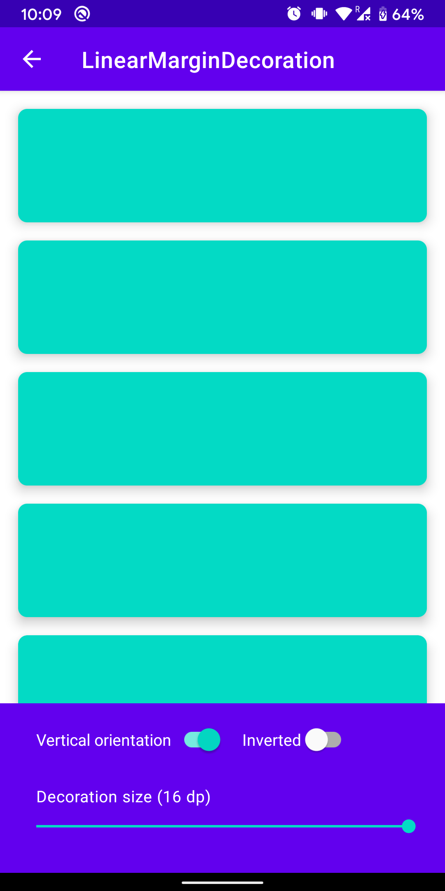
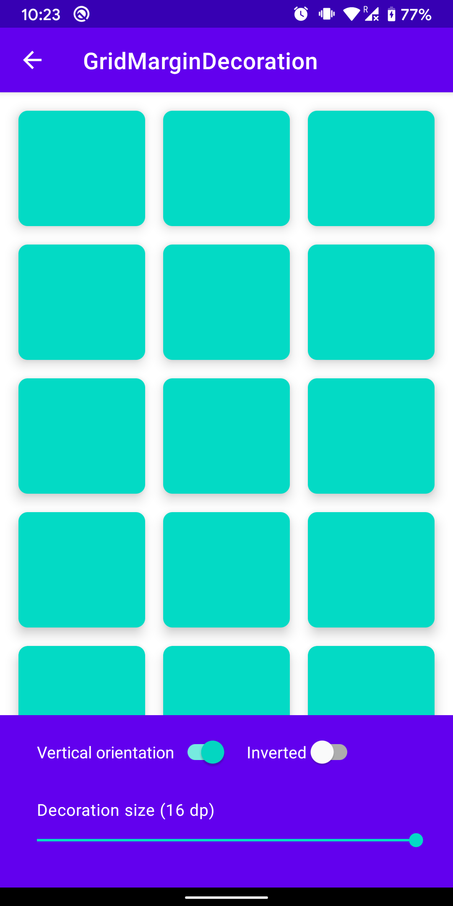
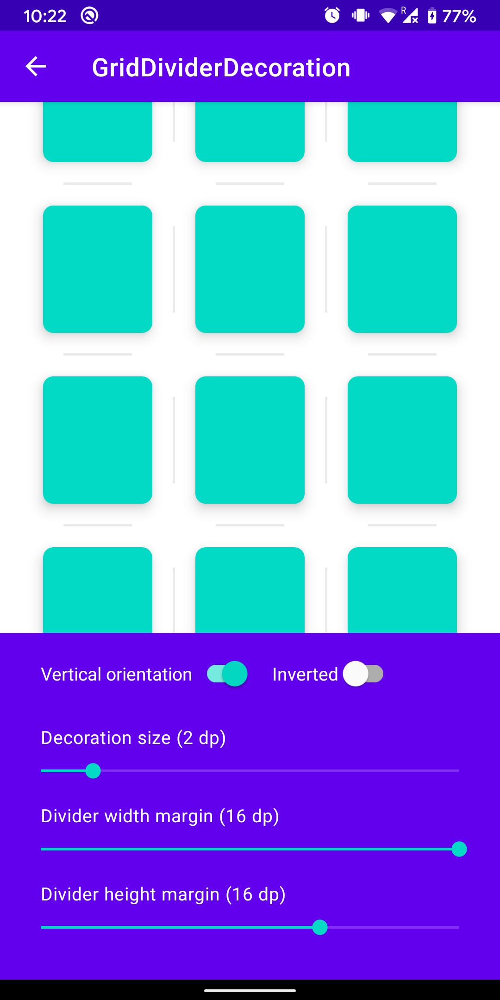
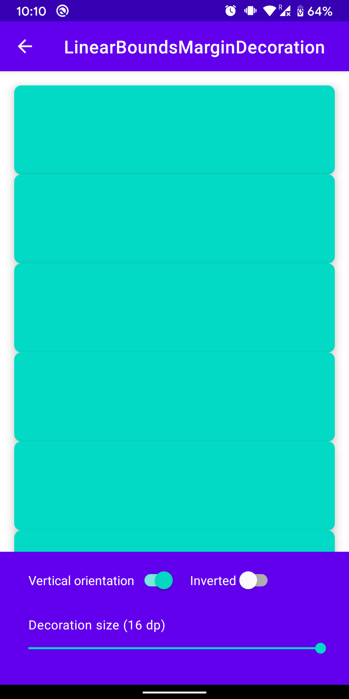

# Decorator

In Android, when you work with RecyclerViews, the standard way of working with paddings and margins is to work with fixed dimensions inside of the layout files.

While this works for many applications, sometimes the margins inside the layout files shouldn't be applied in every screen.

Decorator is a library that helps creating composable margins and dividers in RecyclerViews.

## Install

```groovy
implementation 'io.cabriole:decorator:1.1.0'
```

Replace x.x.x with the latest version available

## How to use

Just create one of the decorations provided in the next examples and add them to the RecyclerView using:

```kotlin
recyclerView.addItemDecoration(decoration)
```

## Margin decorations

These decorations draw a margin between the items.

#### LinearMarginDecoration

</img>

```kotlin
recyclerView.addItemDecoration(LinearMarginDecoration(
    leftMargin = resources.dpToPx(16),
    topMargin = resources.dpToPx(16),
    rightMargin = resources.dpToPx(16),
    bottomMargin = resources.dpToPx(16),
    orientation = RecyclerView.VERTICAL
))
```

#### GridMarginDecoration

</img>

```kotlin
recyclerView.addItemDecoration(GridMarginDecoration(
    margin = resources.dpToPx(16),
    columnProvider = object : ColumnProvider {
        override fun getNumberOfColumns(): Int = 3
    },
    orientation = RecyclerView.VERTICAL
))
```


#### GridSpanDecoration

</img>

```kotlin
recyclerView.addItemDecoration(GridSpanMarginDecoration(
    margin = resources.dpToPx(8),
    gridLayoutManager = gridLayoutManager,
    orientation = RecyclerView.VERTICAL
))
```

## Divider decorations

These decorations draw a divider between the items

#### LinearDividerDecoration

</img>


```kotlin
recyclerView.addItemDecoration(LinearDividerDecoration.create(
    color = ContextCompat.getColor(context, R.color.colorDivider),
    size = resources.dpToPx(4),
    leftMargin = resources.dpToPx(64),
    topMargin = resources.dpToPx(16),
    rightMargin = resources.dpToPx(64),
    bottomMargin = resources.dpToPx(16),
    orientation = RecyclerView.VERTICAL
))
```

#### GridDividerDecoration

</img>

```kotlin
recyclerView.addItemDecoration(GridDividerDecoration.create(
    color = ContextCompat.getColor(context, R.color.colorDivider),
    size = resources.dpToPx(2),
    columnProvider = object : ColumnProvider {
        override fun getNumberOfColumns(): Int = 3
    },
    widthMargin = resources.dpToPx(16),
    heightMargin = resources.dpToPx(16),
    orientation = RecyclerView.VERTICAL
))
```

## Bounds margin decorations

These decorations are similar to the margin decorations,  
but they only draw a margin in the bounds of the list.

#### LinearBoundsMarginDecoration

</img>

```kotlin
recyclerView.addItemDecoration(LinearBoundsMarginDecoration.create(
    margin = resources.dpToPx(8),
    orientation = RecyclerView.VERTICAL
))
```

#### GridBoundsMarginDecoration

</img>

```kotlin
recyclerView.addItemDecoration(GridBoundsMarginDecoration.create(
    margin = resources.dpToPx(16),
    columnProvider = object : ColumnProvider {
        override fun getNumberOfColumns(): Int = 3
    }
))
```

## Composing decorations

If you want to apply multiple decorations, you just need to add the decorations in the correct order.

Example for a vertical RecyclerView:

```kotlin
// Add a vertical margin to the first and last items. 
// The first item will have a top margin and the last item a bottom margin
recyclerView.addItemDecoration(
    LinearBoundsMarginDecoration(
        leftMargin = 0,
        rightMargin = 0,
        topMargin = edgeDecorationSize,
        bottomMargin = edgeDecorationSize
    )
)

// Add a margin between all items
recyclerView.addItemDecoration(
    LinearMarginDecoration(
        leftMargin = 0,
        rightMargin = 0,
        topMargin = marginDecorationSize,
        bottomMargin = marginDecorationSize
    )
)

// Finally, add a divider between the items while respecting the previous margins:
recyclerView.addItemDecoration(LinearDividerDecoration.create(
    color = ContextCompat.getColor(context, R.color.colorDivider),
    size = fragment.dpToPx(2)
))

```

You can also decide if an item at a given position should have a decoration applied:

```kotlin

decoration.setDecorationLookup(object : DecorationLookup {

    // Don't apply the decoration on position 4
    override fun shouldApplyDecoration(position: Int, itemCount: Int): Boolean {
        return position != 4
    }
    
})
```

## License

    Copyright 2020 Cabriole
    
    Licensed under the Apache License, Version 2.0 (the "License");
    you may not use this file except in compliance with the License.
    You may obtain a copy of the License at
    
        http://www.apache.org/licenses/LICENSE-2.0
    
    Unless required by applicable law or agreed to in writing, software
    distributed under the License is distributed on an "AS IS" BASIS,
    WITHOUT WARRANTIES OR CONDITIONS OF ANY KIND, either express or implied.
    See the License for the specific language governing permissions and
    limitations under the License.
